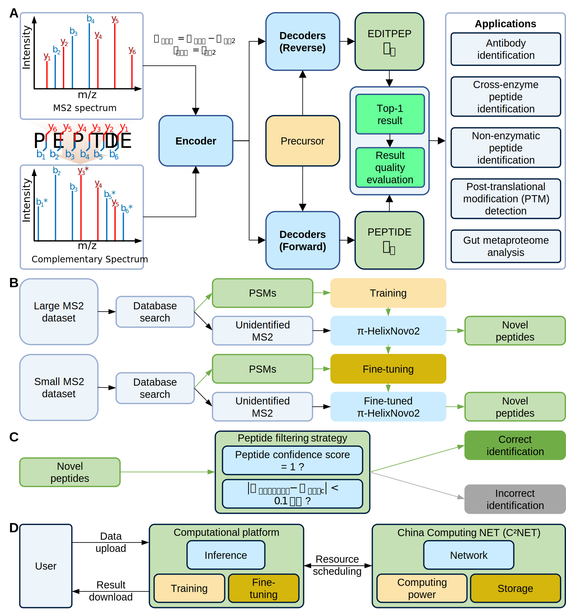

# π-HelixNovo2
π-HelixNovo2 is an updated novel de novo peptide sequencing model that extracts accurate representations from MS data with the supplement of the complementary spectrum and employs a bidirectional decoding architecture to enhance peptide decoding. π-HelixNovo2 also integrates a quality control (QC) strategy for evaluating de novo peptides, and delivers reliable performance in identifying antibody peptides, multi-enzyme cleavage peptides, non-enzymatic peptides, detecting post-translational modifications, and analyzing the gut metaproteome. Moreover, we present the first open, user-friendly, and online computational platform (https://openi.pcl.ac.cn/OpenI/pi-HelixNovo-NPU), enabling accurate de novo peptide sequencing for all, particularly for users without programming expertise. The model weights we have trained are avaliable at https://zenodo.org/uploads/12527491. If you use π-HelixNovo2 in your work, please cite the following publication: 

**π-HelixNovo**: Tingpeng Yang, Tianze Ling, Boyan Sun, Zhendong Liang, Fan Xu, Xiansong Huang, Linhai Xie, Yonghong He, Leyuan Li, Fuchu He, Yu Wang, Cheng Chang, Introducing π-HelixNovo for practical large-scale de novo peptide sequencing, Briefings in Bioinformatics, Volume 25, Issue 2, March 2024, bbae021, https://doi.org/10.1093/bib/bbae021

**π-HelixNovo2**: π-HelixNovo2: making accurate online de novo peptide sequencing available to all. (Preparing...)

# π-HelixNovo2 workflow


# The usage of our code
## Preparation:
### For linux users
Enter the code folder

```
conda env create -f main_env.yaml
conda activate main_env 
```

### For windows users
Refer to [Run π-HelixNovo2 in Docker](./run_in_docker/docker-env.md)
## Specify the device

```
--gpu=-1 # run pi-HelixNovo on CPU
--gpu=0 # run pi-HelixNovo on GPU 0
--gpu=0,1 # run pi-HelixNovo on GPU 0,1; Distributed deep learning
```

## Train a model from scratch:

```
python main.py --mode=train --gpu=0 --config=./config.yaml --output=train.log --peak_path=./sample_data/training_set/*.mgf --peak_path_val=./sample_data/validation_set/*.mgf
```

## De novo peptide sequencing

```
python main.py --mode=denovo --config=./config.yaml --gpu=0 --output=denovo.log --peak_path=./sample_data/denovo_sample/sample.mgf --model=the_path_of_your_model
```
The results will be shown in the current folder as **denovo**_denovo.txt because --output=**denovo**.log
| TITLE | Peptide-F1 | p-F1 | Peptide-R1 | p-R1 | Peptide-F2 | p-F2 | Peptide-R2 | p-R2 | Peptide | p |  
| :--: | :--: | :--: | :--: | :--: | :--: | :--: | :--: | :--: | :--: | :--: |  
| 27 | VLEGHAEK | 0.91 | VLEGHAEK | 0.93 | VLEGHAEK | 0.96 | VLEGHAEK | 0.95 | VLEGHAEK | 0.96 |  
| 28 | LQHEAATATQK | 0.96 | LQHEATAATQK | 0.90 | LQHEAATATQK | 0.95 | C+57.021GHTDLNRPK | 0.78 | LQHEAATATQK | 0.96 |  
| 29 | KEAPAPPK | 0.99 | KEAAPPPK | 0.99 | KEAPAPPK | 0.98 | KEAAPPPK | 0.96 | KEAPAPPK | 0.99 |

"TITLE" is the TITLE information of the MS spectrum in the corresponding mgf file.

"Peptide-F1" and "p-F1" represent the peptide and its confidence score generated by the first Forward Decoder, while "Peptide-F2" and "p-F2" correspond to the second Forward Decoder.

"Peptide-R1" and "p-R1" represent the peptide and its confidence score generated by the first Reverse Decoder, while "Peptide-R2" and "p-R2" correspond to the second Reverse Decoder.

"Peptide" and "p" represent the final peptide and its confidence score of π-HelixNovo2 based on the above results.

## Evaluate the results of de novo peptide sequencing

```
python evaluate-result.py --denovo-result denovo_denovo.txt --config ./config.yaml --mgf ./sample_data/denovo_sample/sample.mgf --thresh 1.0
```
The results will be shown in the current folder as "denovo_denovo.txt_evaluate.txt".

The first line of the file "denovo_denovo.txt_evaluate.txt" indicates the AA precision, AA recall and peptide recall of π-HelixNovo2 model "the_path_of_your_model" when performing de novo peptide sequencing on the MS2 spectra in ./sample_data/denovo_sample/sample.mgf

Starting from the second line, the ground truth peptide for each item in the file "denovo_denovo.txt" is appended after the item, shown as:

| TITLE | Peptide-F1 | p-F1 | Peptide-R1 | p-R1 | Peptide-F2 | p-F2 | Peptide-R2 | p-R2 | Peptide | p | Ground-truth-peptide |
| :--: | :--: | :--: | :--: | :--: | :--: | :--: | :--: | :--: | :--: | :--: | :--: |

## Evaluate the performance of the quality control strategy we proposed to filtering the correct PSMs from the results of de novo peptide sequencing

```
python evaluate-result-QC.py --denovo-result denovo_denovo.txt --config ./config.yaml --mgf ./sample_data/denovo_sample/sample.mgf --thresh 1.0
```
The metrics, including accuracy, sensitivity, specificity, ppv, npv, and F1 score will be displayed in the terminal.

## The config.yaml used in pi-HelixNovo
To train models on the nine-species benchmark dataset, please use config.yaml  

To train models on the merged dataset of PXD008808, PXD011246, PXD012645 and PXD012979, please use merge-config.yaml.

To  train models on the MSV000081142 dataset, please use config.yaml

To  train models on the datasets used in GraphNovo, please use config-graph.yaml

To  train models on the datasets used in PepNet, please use config-pepnet.yaml

To  train models on the MSV000082287 dataset (MS2 spectra of human gut bacteria proteins), please use config-gut.yaml

# Recommendation
For practical large-scale de novo peptide sequencing, we highly recommend utilizing the model weight "Powerful-pi-HelixNovo2/ModelWeights/Trained-On-MSV000081142.ckpt", which was trained on the MSV000081142 dataset, while employing the "config.yaml" configuration file.
