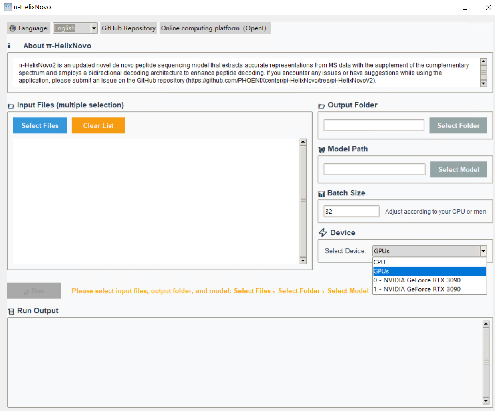

# 
  π-HelixNovo Homepage 

# Introduction and Publications
π-HelixNovo is a de novo sequencing model based on the Transformer architecture, using MS2 spectra as inputs and generating the corresponding peptides. If you use π-HelixNovo in your work, please cite the following publication: 

**π-HelixNovo**: Tingpeng Yang, Tianze Ling, Boyan Sun, Zhendong Liang, Fan Xu, Xiansong Huang, Linhai Xie, Yonghong He, Leyuan Li, Fuchu He, Yu Wang, Cheng Chang, Introducing π-HelixNovo for practical large-scale de novo peptide sequencing, Briefings in Bioinformatics, Volume 25, Issue 2, March 2024, bbae021, https://doi.org/10.1093/bib/bbae021

**π-HelixNovo2**: Tingpeng Yang, Tianze Ling, Boyan Sun, Zhendong Liang, Cheng Lai, Jiangli Hu, Zexuan Yi, Yonghong He, Leyuan Li, Yue Yu, Cheng Chang*, Yu Wang*. π-HelixNovo2: making accurate online de novo peptide sequencing available to all. Genomics, Proteomics & Bioinformatics, accepted in principle.

# Code availability
## π-HelixNovo
**π-HelixNovo** is the first version of the software. It proposes the complementary spectrum to enhance the ion information of a MS2 spectrum and is available at [**this branch**](https://github.com/PHOENIXcenter/pi-HelixNovo/tree/pi-HelixNovo).
## π-HelixNovo2
**π-HelixNovo2** is an updated version of π-HelixNovo that extracts accurate representations from MS data with the supplement of the complementary spectrum and employs a bidirectional decoding architecture to enhance peptide decoding. π-HelixNovo2 also integrates a quality control (QC) strategy for evaluating de novo peptides, and present the first open, user-friendly, and online [**computational platform**](https://openi.pcl.ac.cn/OpenI/pi-HelixNovo-NPU), enabling accurate de novo peptide sequencing for all, particularly for users without programming expertise. π-HelixNovo2 is available at [**this branch**](https://github.com/PHOENIXcenter/pi-HelixNovo/tree/pi-HelixNovoV2).
# Hardware requirements
## GPU
- Train a model from scratch: An NVIDIA GPU with enough computing power and memory (e.g., Tesla V100 with 32GB of memory).
- Evaluate a pretrained model or de novo sequencing: CPU (slow) or an NVIDIA GPU (e.g., GeForce RTX 3050 with 4GB of memory, ..., Tesla V100 with 32GB of memory). If the error “CUDA OUT OF MEMORY” occurs, please decrease the “predict_batch_size” in the config.yaml.
## Storage space
- Windows system: C drive with enough storage space.
- Linux system: A hard disk with enough storage space.
# The usage of our software
## For users with programming expertise
Referring to user guides of [**π-HelixNovo**](https://github.com/PHOENIXcenter/pi-HelixNovo/tree/pi-HelixNovo) and [**π-HelixNovo2**](https://github.com/PHOENIXcenter/pi-HelixNovo/tree/pi-HelixNovoV2).
## For users without programming expertise
- The [**computational platform**](https://openi.pcl.ac.cn/OpenI/pi-HelixNovo-NPU) has been prepared for users without programming expertise, with an [**operation video**](https://openi.pcl.ac.cn/OpenI/pi-HelixNovo-NPU/src/branch/main/User-guide-English.mp4) attached.
- We also prepared a Graphical User Interface (GUI) version for Windows users, which can be downloaded from [**here**]().
  1. Unzip π-HelixNovo.7z.
  2. Ensure that your Windows system is 64 bit (only 64 bit system is supported), and the corresponding NVIDIA Driver has been installed for the GPUs in your machine.
  3. Double click π-HelixNovo.exe.
  4. Select mgf files as Input Files.
  5. Select the Output Folder.
  6. Select the model (model.ckpt) we provided to fill the Model Path.
  7. Choose the device (GPUs refers to all GPUS available).
  8. Click RUN

