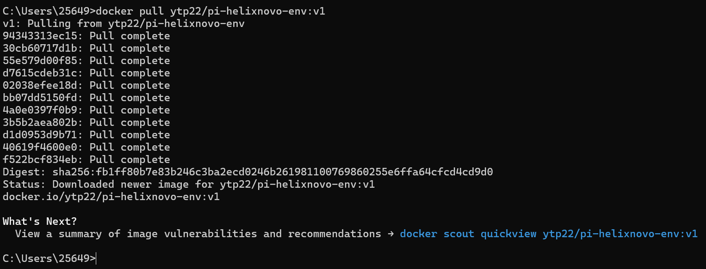
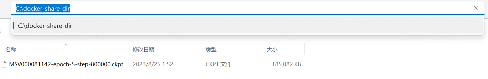
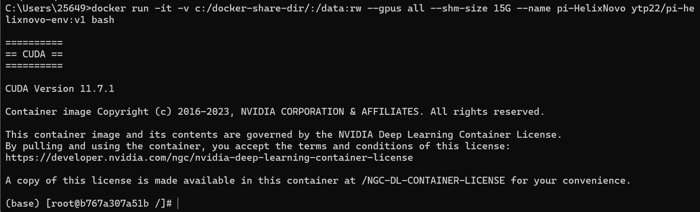
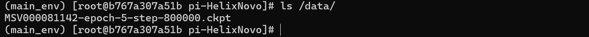
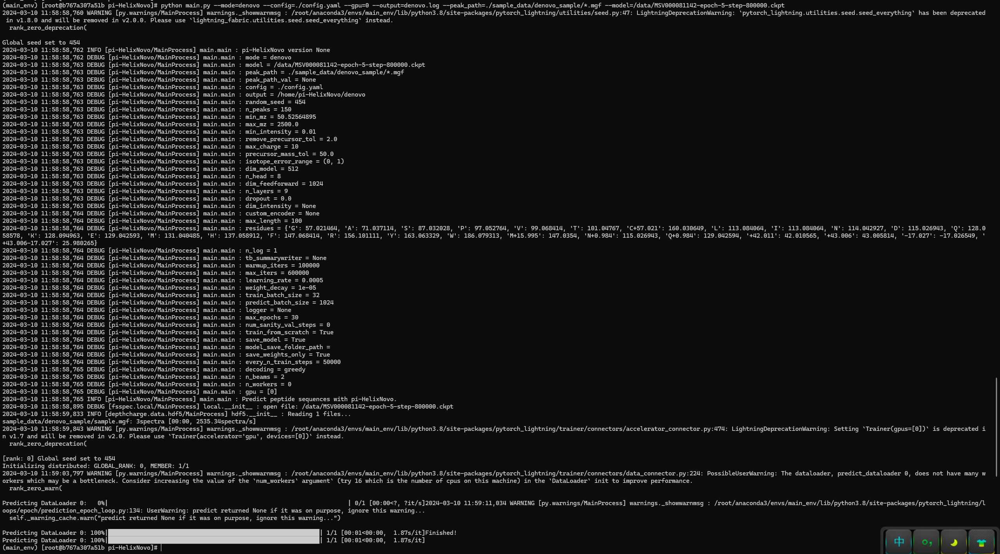
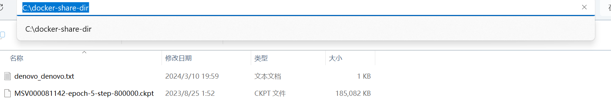

# Run pi-HelixNovo in Docker

- Setup the Docker Desktop
- Open Docker Desktop
- Sign in Docker Desktop (Sign up first if you don’t have an account)
- Open the CMD and running the following commands:

```
docker pull ytp22/pi-helixnovo-env:v1
```



- Make a dir (c:/docker-share-dir) and put the pretrained model weights in it.



```
docker run -it -v c:/docker-share-dir/:/data:rw --gpus all --shm-size 15G --name pi-HelixNovo ytp22/pi-helixnovo-env:v1 bash
```



```
 cd /home/pi-HelixNovo/; conda activate main_env;
```


Note: /data dir corresponds to the c:/docker-share-dir dir



```
python main.py --mode=denovo --config=./config.yaml --gpu=0 --output=denovo.log --peak_path=./sample_data/denovo_sample/*.mgf --model=/data/MSV000081142-epoch-5-step-800000.ckpt
```



If the error “CUDA OUT OF MEMORY” occurs, please decrease the “predict_batch_size” in the config.yaml.

- Move the results to /data

```jsx
mv denovo_denovo.txt /data/
```

You will see the results in c:/docker-share-dir


